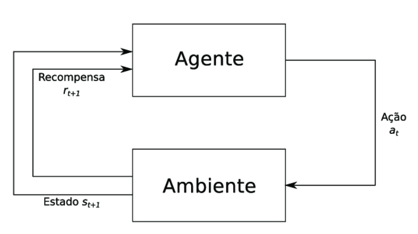
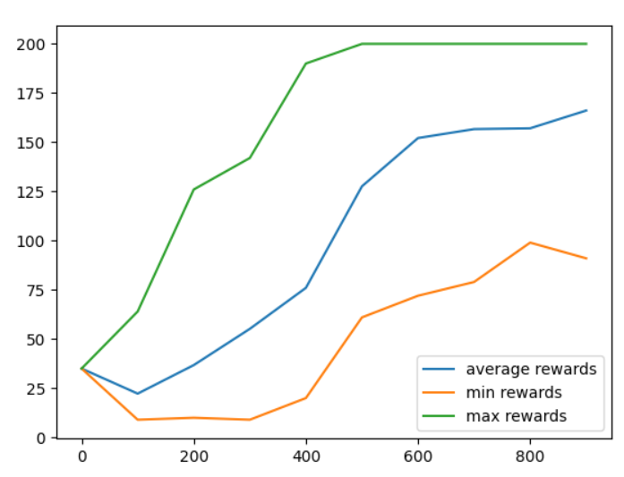

# Links Importantes 

[Wikipedia](https://en.wikipedia.org/wiki/Q-learning)
[Bellman's Equation](https://en.wikipedia.org/wiki/Bellman_equation)

[Documentação](https://gym.openai.com/docs/)

[GitHub](https://github.com/openai/gym)

## Cartpole

A pole is attached by an un-actuated joint to a cart, which moves along a frictionless track. The system is controlled by applying a force of +1 or -1 to the cart. The pendulum starts upright, and the goal is to prevent it from falling over. A reward of +1 is provided for every timestep that the pole remains upright. The episode ends when the pole is more than 15 degrees from vertical, or the cart moves more than 2.4 units from the center.

[Referência cartpole](https://github.com/JackFurby/CartPole-v0/blob/master/cartPole.py)

[Post no medium](https://medium.com/ranbookm/aprendizado-por-refor%C3%A7o-40d8800bd507)

O agente faz uma ação no ambiente

O ambiente troca de estado

Dependendo da troca de estado, o ambiente dá uma recompensa para o agente

O objetivo no final é sempre maximizar a recompensa.

Observe pelo gráfico abaixo, no qual o eixo y indica as recompensas e o eixo x representa os steps, que as recompensas são maximizadas com o decorrer dos steps.

O grande lance do aprendizado por reforço é, por meio da Q-table, as recompensas são atualizadas recursivamente e, com isso, a recompensa total do ambiente aumente mais e mais a cada época.

Para isso existe o discount factor $\gamma$ que força uma queda da interferência dos steps passados para a decisão atual e para a decisão futura.

Quanto maior o discount factor menor a interferência dos steps anteriores na decisão.

Quanto menor o discount factor, maior a interferência dos steps anteriores na decisão e menor a relevância do step imediatamente anterior para a decisão.

# Deep Q-Learning

Bibliografia em português

[Deep Learning Book](http://deeplearningbook.com.br/deep-q-network-e-processos-de-decisao-de-markov/)

[Deep Q-learning medium](https://medium.com/ai%C2%B3-theory-practice-business/reinforcement-learning-part-7-a-brief-introduction-to-deep-q-networks-aa45314a2ae)

[Deep Q-Learning Wikipedia](https://en.wikipedia.org/wiki/Deep_reinforcement_learning)

[How to write markdown](https://csrgxtu.github.io/2015/03/20/Writing-Mathematic-Fomulars-in-Markdown/)
